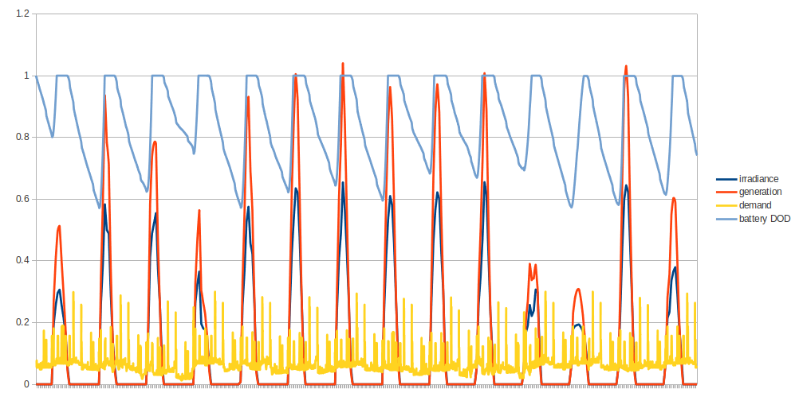
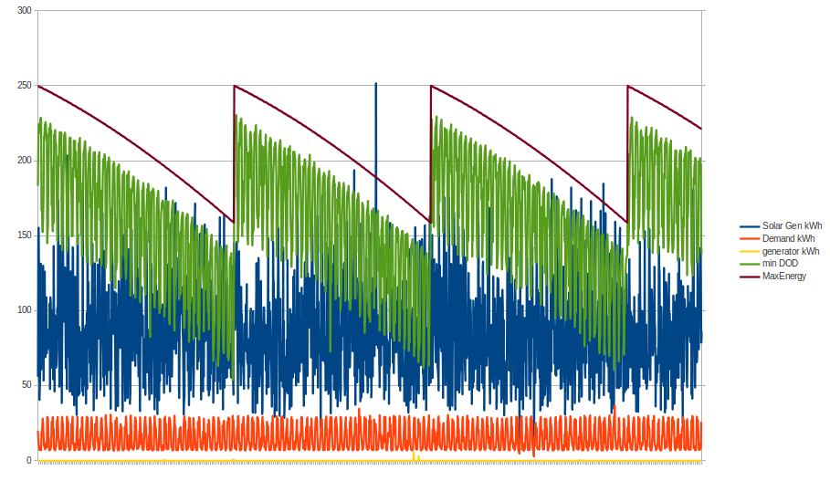
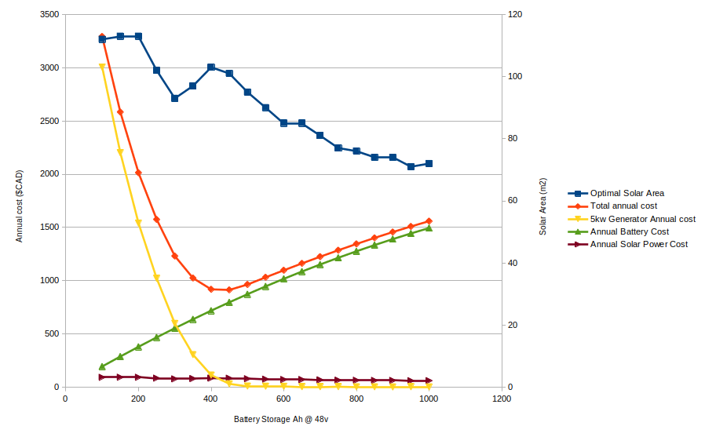
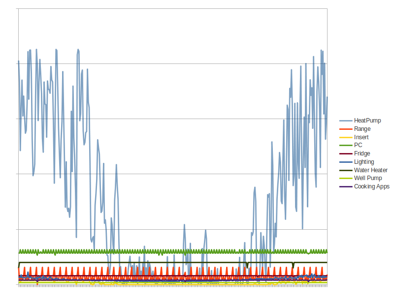
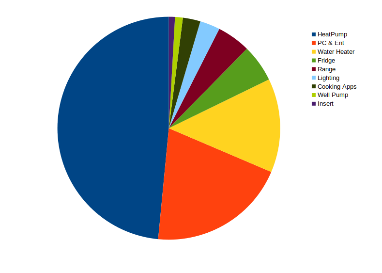

Solar Battery Simulation
===

A battery can be a great expense in a solar system installation. So much so, that it often puts the cost 
out of reach of typical households. 

This project aims to find the perfect sizing of solar array, battery capacity, angles of the solar panels, 
and other parameters to minimize total system costs, for a particular region of the world. 

### Data

Included in this repository 
is a weather dataset from CWEEDs, taken from sensors in Fredericton Canada, but if simulating for other locations 
you will need to find an appropriate source of weather data. 
 
Weather fields used in the simulation are *temperature*, *solar irradiance*, *wind direction*, *wind speed*, and time of day.
 
---

### Approach  
 
I use real weather data of solar irradiance, cloud cover, temperature, taken from local measurements to 
simulate solar generation capacity. I use a model of typical household appliances to simulate demand and 
calibrate this usage with my past seasonal power consumption data.  

The trick is to find the best zenith angle of the solar array that maximizes solar generation when demand is at its peak. 
The challenge in northern climates is that electricity demand peaks in winter when the number of solar hours per day is lowest. 

### API

Energy demand sources are easily created using the DemandModel API. These demand sources can be conditioned on the many parameters of the hourly weather record to make them more reactive and accurate.
 
For example, this code adds a lighting demand, and draws 80 watts between hours 9am and 10pm, but only if the sun is dim:
```// lights
demandModel.addDemand(new ComputedDemand(r -> {
    if(r.record.hour >= 9 && r.record.hour <= 22 && r.record.solarWm2 < 200)
        new Watt(80.0);
    return new Watt(0.);
}, "Lighting"));
```


### Charts

#### Solar System Analysis
 
Demand, solar generation, battery depth of discharge, and solar irradiance over a period of approx 2 weeks.
Note how the battery discharges overnight, but not to a DOD that degrades its long term performance.  


--- 
This is the simulation using best battery size and solar array size over 128 years; note the battery 
capacity degrading over a period of approx 48 years from regular cycling. Despite the degredation, it 
very rarely falls below the level that would incur costly backup generator usage.  



---

Values determined by grid search for the best total system cost as a function of battery size. 
Costs of battery and backup generator are amortized annually.



---

#### Demand Analysis

This chart shows the yearly domestic energy demand cycle given my demand source assumptions.  

 


---

Yearly domestic demand distribution given my demand source assumptions. 

